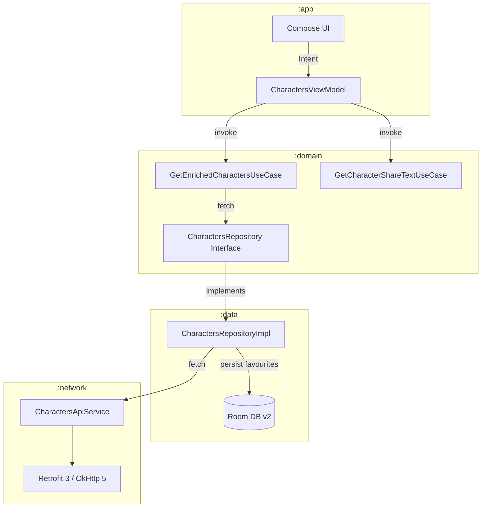

# Coding Challenge — Rick & Morty Browser

A production-quality Android application built with **Clean Architecture**, **MVI**, and **Jetpack Compose**. The app browses Rick & Morty characters with live search, infinite pagination, offline-persisted favourites, and a full CI/CD pipeline.

---

## Note on Data Source

This project uses the public [Rick & Morty API](https://rickandmortyapi.com/) as its data source instead of a marketplace API. The domain fields differ — characters have species, status, origin, and location rather than price, description, and seller info — but the **architecture is identical** to how a marketplace item list would be built. The repository layer, use cases, ViewModels, and UI state model are all data-agnostic; swapping the API and domain model would leave every architectural pattern intact.

All three extra features from the brief (Search, Favourites, Share) are fully implemented.

---

## Features

| Feature | Detail |
|---|---|
| **Character list** | Infinite-scroll grid loaded from the Rick & Morty API |
| **Live search** | 1-second debounce, API-side filtering via `?name=` query param |
| **Pagination** | Append-on-scroll; triggers when 4 items from the end of the list |
| **Favourites** | Persisted in Room DB; synced in real time across list and detail screens |
| **Character detail** | Full info screen with species, status, origin, location |
| **Share** | Android share-sheet with formatted character card text |
| **Offline support** | Favourites survive network loss via Room; list served from in-memory StateFlow cache |
| **Error & retry** | Full-screen error + retry on initial load; sticky in-grid retry banner on pagination failure |
| **Shimmer loading** | Skeleton shimmer on initial load, pagination, and detail screen image load |

---

## Architecture

### Multi-Module Clean Architecture

```
:app  ──▶  :domain  ──▶  :data  ──▶  :network
 │             │
 └──▶  :core ◀─┘
```

| Module | Responsibility |
|---|---|
| **`:app`** | Compose UI, ViewModels, MVI State/Intent/Effect, Navigation, Theme |
| **`:domain`** | Use cases, repository interfaces, domain models — zero Android dependencies |
| **`:data`** | Repository implementations, Room DB, DAOs, mappers, NetworkHelper |
| **`:network`** | Retrofit 3 + OkHttp 5 client, token caching, logging interceptor |
| **`:core`** | `MviViewModel` base class, SharedPreferences, shimmer Modifier extension |

### MVI Pattern

Every screen follows strict unidirectional data flow:

```
UI (Compose)  ──Intent──▶  ViewModel  ──UseCase──▶  Repository  ──▶  [API / Room]
     ▲                          │
     └────State / Effect────────┘
```

**`MviViewModel<S, I, E>`** (`:core`)
- **State** — `MutableStateFlow<S>` updated atomically via `setState { reduce() }`
- **Intent** — buffered `Channel<I>` (capacity 64); every user action is a named, inspectable object
- **Effect** — conflated `Channel<E>` for one-time events (navigation, share sheet, toast)

### Data Flow Diagram



---

## Screen-by-Screen Architecture

### Character List Screen

**State model (`CharactersState`):**

```kotlin
data class CharactersState(
    val characters: List<CharacterUi> = emptyList(),
    val isLoading: Boolean = false,
    val isLoadingNextPage: Boolean = false,
    val error: String? = null,           // full-screen failure only
    val paginationError: String? = null, // in-grid sticky banner only
    val currentPage: Int = 1,
    val totalPages: Int = 1,
    val searchQuery: String = "",
    val isInitialLoading: Boolean = true,
)
```

Two separate error fields exist by design — `error` replaces the entire grid with a retry screen; `paginationError` shows a sticky banner at the bottom of the existing list without destroying what the user is already reading. Merging them into one field would make it impossible to distinguish these two fundamentally different failure modes.

**Search and pagination concurrency:**

`searchParams: MutableStateFlow<Pair<String, Int>>` carries the search query and a generation counter. `flatMapLatest` cancels the previous API call whenever a new pair is emitted, making concurrent stale results structurally impossible without any manual job tracking at the search layer.

The generation counter solves `StateFlow`'s deduplication behaviour: tapping "Retry" on an unchanged query would normally be a no-op because the value hasn't changed. Incrementing the integer forces a new emission and re-triggers the full search pipeline.

`paginationJob: Job?` is tracked separately because pagination runs outside `flatMapLatest`. Without explicit cancellation, page 3 results from a previous query could arrive on top of page 1 results from a new query.

**Debounce strategy:**

| Condition | Delay |
|---|---|
| Retry (generation > 0) | 0 ms — immediate |
| Query cleared | 0 ms — immediate |
| New keystroke | 1 000 ms — debounced |

**Shimmer:** `isInitialLoading = true` on startup drives a full-grid skeleton. It is a separate flag from `isLoading` so that pagination loading (which should show a shimmer only in the grid footer, not replace the whole screen) doesn't re-trigger the full-screen skeleton.

**Favourite enrichment:** `GetEnrichedCharactersUseCase` uses `combine` to merge the API character list with `FavouritesRepository.getFavouriteCoverUrls(): Flow<Set<String>>`. When the user toggles a favourite on the detail screen, Room emits a new set, `combine` re-fires, and every card in the list immediately updates — no network call, no manual list mutation.

**Empty states:**

| Scenario | UI |
|---|---|
| No characters, search empty | `EmptyState` with title + retry button |
| Search returns 404 | `EmptySearchState` with query text + "try a different term" hint |
| API error on initial load | Full-screen `ErrorMessage` with HTTP-specific message + Retry button |
| Pagination failure | Sticky `TextButton` footer in grid — loaded list preserved |

---

### Character Detail Screen

**State model (`CharacterDetailState`):**

```kotlin
data class CharacterDetailState(
    val character: CharacterDetailUi? = null,
    val isLoading: Boolean = true,
    val error: String? = null,
    val isFavourite: Boolean = false,
)
```

`isFavourite` is a live Flow observed via `IsFavouriteFlowUseCase`. It is kept as a separate field from `character` because the favourite state can change at any time (the user toggled it on the list screen while the detail was on the back stack) without requiring a re-fetch of the character data.

**Assisted injection:**

`CharacterDetailViewModel` uses Hilt's `@AssistedInject` + `@HiltViewModel(assistedFactory = ...)`. The character ID is passed at screen creation time through the navigation key rather than through the saved state handle. This makes the factory type-safe and removes the need for a `SavedStateHandle` string key contract.

**Share via Effect:**

`ShareCharacter` intent triggers `GetCharacterShareTextUseCase` inside the ViewModel, which returns a pure Kotlin string with no Android dependencies. The formatted text is then emitted as `CharacterDetailEffect.Share(text)` through the Effect channel. The composable collects it via `flowWithLifecycle` and calls `startActivity` — the only Android-specific line in the share flow. This separation means share-text formatting is fully unit-testable without a Robolectric context.

**Favourite real-time sync:**

After a successful character load, the ViewModel immediately starts `observeFavourite(imageUrl)` in a separate coroutine. The composable's heart icon updates as soon as Room writes, regardless of which screen performed the toggle. The detail and list screens are always consistent because they both read from the same Room Flow.

**Image loading:**

The detail screen has two shimmer layers: a full-layout `CharacterDetailShimmer` while the API call is in flight, and a second image-only shimmer inside `CharacterDetailContent` while Coil fetches the hero image. `AsyncImagePainter.State` callbacks flip `imageLoaded` and `imageError` flags so the shimmer and error overlay are removed at the right moment. When Coil cannot load the image, an `ImageErrorPlaceholder` overlay is shown instead of a broken image.

**Retry:**

`CharacterDetailIntent.Retry` cancels `loadJob` (if somehow still running) and restarts `loadCharacter(navKey.id)`. The `error` field is cleared and `isLoading` is set to true synchronously before the new request starts.

---

## Key Technical Decisions

### Why MVI over MVVM?

Plain MVVM works well for simple screens with one or two independently-updating data streams. The character list screen is not simple — search, pagination, retry, and favourite toggles all run concurrently and all touch the same state. With MVVM and multiple `LiveData`/`StateFlow` fields, the UI must reconcile independently-updating streams and it becomes easy to render inconsistent combinations (`isLoading=true` with `error != null`, or a stale `characters` list displayed while a new search is loading).

MVI enforces a **single immutable state object** and a **single update path** (`setState { copy(...) }`). Every possible screen combination is an explicit, named state. Debugging means reading a sequential log of intents. Testing means asserting one object before and after an action.

The custom `MviViewModel<S, I, E>` base class in `:core` is intentionally thin — it provides the channel/flow wiring but imposes no constraint on how `handleIntent()` is implemented, so coroutine-based async work fits naturally.

### Why layer modules over feature modules?

Layer modules (`:app`, `:domain`, `:data`, `:network`, `:core`) and feature modules (`:feature:characters`, `:feature:favourites`) are not mutually exclusive — they are different phases of the same scaleable architecture. Layer modules are the **foundation** that feature modules build on top of.

Layer modules deliver:
- **Faster incremental builds** — Gradle only recompiles the layers whose inputs changed. Touching a ViewModel recompiles `:app` only; touching a use case recompiles `:domain` and `:app`, but not `:data` or `:network`.
- **Hard compile-time boundaries** — `:domain` literally cannot import Android classes. `:data` cannot reach into `:app`. These are enforced by the module graph, not by convention.
- **Trivially testable domain logic** — `:domain` has zero Android dependencies, so use cases and repository interfaces run in plain JUnit without Robolectric or an emulator.

When the app grows to 3+ features with dedicated teams, feature modules slot in on top of the existing layer structure:

```
:feature:characters ──▶  :domain  ──▶  :data  ──▶  :network
:feature:favourites ──▶  :domain               └──▶ :core
:feature:episodes   ──▶  :domain
:app  (thin orchestrator: navigation + DI graph assembly)
```

The layer modules are not replaced — they become the shared infrastructure every feature module depends on. Starting with layer modules is the correct first step toward this structure.

### Search + Pagination concurrency

`searchParams: MutableStateFlow<Pair<String, Int>>` carries the query string and a **generation counter**. `flatMapLatest` cancels the previous inner flow on every new emission, making concurrent searches structurally impossible. Pagination jobs are tracked in `paginationJob: Job?` and cancelled the moment a new search fires.

### Retry without re-debounce

The generation counter doubles as a retry trigger — incrementing it forces a new StateFlow emission even when the query string is unchanged, bypassing the 1-second debounce window without any special-case branching in the debounce lambda.

### Rate-limit handling

`withRetry()` in `NetworkHelper.kt` retries up to 20 times on HTTP 429, with an injectable delay provider (`delayProvider: suspend (Long) -> Unit`). All other errors fail immediately. Tests pass `{}` as the delay provider and run synchronously without `advanceTimeBy`.

### Favourites enrichment

`GetEnrichedCharactersUseCase` combines the API response `Flow` with `FavouritesRepository.getFavouriteCoverUrls(): Flow<Set<String>>` using `combine`, so the favourite icon on every character card updates reactively without re-fetching from the network.

### Pagination error handling

When page 2+ fails, the loaded list is preserved and a sticky **"Failed to load more. Tap to retry."** banner replaces the loading indicator in the grid footer. This requires `paginationError: String?` as a separate state field from `error: String?` — a full-screen error cannot be reused here because it would destroy the content the user is already reading.

### Assisted injection for detail screen

`CharacterDetailViewModel` uses Hilt's `@AssistedInject` factory pattern so the character ID (from the navigation key) can be passed at runtime while all other dependencies are provided by the DI graph. Alternative: `SavedStateHandle` — but that requires an agreed string key and is not type-safe.

---

## Trade-offs and Alternatives Considered

| Area | Chosen | Alternative considered | Why chosen |
|---|---|---|---|
| **Pagination** | Manual scroll-threshold | Paging 3 | Paging 3 adds significant complexity (PagingSource, RemoteMediator, PagingData adapter) that is only justified for large datasets or multi-source pagination. A single API with simple append semantics does not need it. |
| **State management** | MVI (single state + intents) | Plain MVVM (multiple StateFlows) | MVI prevents inconsistent UI state combinations when multiple async operations touch overlapping fields. |
| **Module structure** | Layer modules as the base | Feature modules added on top as the app grows | Layer modules are the correct foundation — they enforce compile-time boundaries and faster incremental builds today, and become the shared infrastructure that feature modules depend on when the team scales. |
| **Offline list cache** | In-memory StateFlow | Room persistence | Full list persistence would require a TTL strategy and cache invalidation logic. In-memory cache covers the app session; favourites are always persisted. |
| **Favourite PK** | Image URL | Character ID | URL-based PK survives API schema changes and works across any character source without coupling to Rick & Morty's ID scheme. |
| **Share text** | ViewModel use-case | Compose/UI layer | Keeps pure Kotlin logic fully unit-testable without an Android context. |
| **Retry mechanism** | Generation counter | Separate retry StateFlow | A single StateFlow with a generation counter avoids coordinating two flows; the same debounce lambda handles both search and retry cases. |
| **Error channel** | Two fields (error + paginationError) | Single error field | A single field cannot express "partial failure — show banner + keep list" vs "total failure — replace screen". |
| **Navigation** | Jetpack Navigation 3 | Compose Navigation (Destinations) | Navigation 3 was already in the project scaffold and integrates cleanly with Compose's recomposition model via `rememberNavBackStack()`. |

---

## How to Extend for New Requirements

### Adding a new screen (e.g. Episodes)

1. **`:domain`** — add `Episode` domain model, `EpisodesRepository` interface, `GetEpisodesUseCase`
2. **`:data`** — add `EpisodesRepositoryImpl`, DTO, mapper, and optionally a Room table
3. **`:app`** — add `EpisodesState`, `EpisodesIntent`, `EpisodesEffect`, `EpisodesViewModel`, `EpisodesScreen.kt`
4. **`:app` navigation** — add `EpisodesKey` to `CharacterRoutes.kt` and an `entryProvider` block in `CharacterNavGraph.kt`

No existing module needs to be modified except `:app`'s navigation graph.

### Adding filters or sorting

Add filter parameters to `CharactersParams` in `:domain`. The ViewModel emits a new `searchParams` value containing the filter, which `flatMapLatest` picks up automatically. The existing debounce and retry logic applies unchanged.

### Adding deep links

Add `deepLinks` to the `NavDisplay` entry in `CharacterNavGraph.kt`. Navigation 3 resolves deep-link URIs to route keys, so the ViewModel receives the same `CharacterDetailKey` whether the user tapped a list item or followed a deep link.

### Adding authentication

`RetrofitClient.kt` already has a token interceptor wired to `UserPreferencesDataStore`. Populate the preference on login and the bearer token will be attached to every request automatically.

### Adding a filter/sort bottom sheet

This is a pure `:app` change. Add `FilterIntent` variants and a `filterParams` field to `CharactersState`. The ViewModel emits a new `searchParams` value with the filter applied, and `flatMapLatest` handles the rest.

---

## How the Architecture Scales in a Larger Team

### Migrating to feature modules

The layer-module structure is the natural foundation for feature modules. When the app grows to 3+ features with dedicated teams:

```
:feature:characters  ──▶  :domain  ──▶  :data  ──▶  :network
:feature:favourites  ──▶  :domain
:feature:episodes    ──▶  :domain
        ↑
      :app (thin orchestrator: navigation + DI graph assembly)
```

Feature modules depend on `:domain` and `:core` but not on each other — the same rule already enforced between `:app` and `:data` today.

### Parallel team ownership

- **`:domain`** — shared ownership; any team can add a use case or interface; no Android code means no build-time Android dependencies on other teams' work
- **`:data`** — database or network changes are isolated here and don't require `:app` recompilation
- **`:app` feature modules** — each squad owns one module; merge conflicts are structurally minimised

### CI/CD scaling

The current pipeline runs all jobs sequentially per PR. As the team grows:
- Split `unit-tests` into per-module jobs (`test-domain`, `test-data`, `test-app`) and run them in parallel
- Cache Gradle build outputs between runs (already using configuration cache)
- Add an emulator job for instrumented tests once Room DAO coverage becomes important
- Promote screenshot baselines to a dedicated branch updated only on approved design changes

### Code quality at scale

- Detekt's `maxIssues: 0` rule prevents lint debt from accumulating regardless of team size
- ktlint enforces a consistent style so code review can focus on logic rather than formatting
- JaCoCo coverage gate (currently ~80%) can be tightened per module as the team matures

---

## Tech Stack

| Layer | Library | Version |
|---|---|---|
| Language | Kotlin | 2.3.20 |
| UI | Jetpack Compose + Material 3 | BOM 2025.x |
| DI | Hilt | 2.59.2 |
| Image loading | Coil | 3.4.0 |
| Database | Room | 2.8.4 |
| Networking | Retrofit 3 + OkHttp 5 | 3.0.0 / 5.3.2 |
| Navigation | Jetpack Navigation 3 | 1.1.0 |
| Async | Coroutines + Flow | 1.10.2 |
| Build | AGP + KSP + Version Catalog | 9.1.1 / 2.3.6 |
| Serialization | Gson + Kotlinx Serialization | 2.13.2 |

---

## Getting Started

### Prerequisites
- **Android Studio** Meerkat (2024.3.1) or newer
- **JDK 17+**
- **Android SDK** API 25–37

### Clone & Run
```bash
git clone https://github.com/AbdulSamadQureshi/coding-challenge.git
cd coding-challenge
git checkout develop           # always work from develop
./gradlew assembleDebug        # build debug APK
```

### Running Tests

```bash
# All unit tests across all modules
./gradlew testDebugUnitTest

# Per-module (faster feedback during development)
./gradlew :domain:testDebugUnitTest
./gradlew :data:testDebugUnitTest
./gradlew :app:testDebugUnitTest

# JaCoCo coverage report → build/reports/jacoco/jacocoFullReport/html/index.html
./gradlew jacocoFullReport

# Screenshot tests — verify against committed baselines
./gradlew :app:verifyRoborazziDebug

# Update screenshot baselines (only after intentional UI changes)
./gradlew :app:recordRoborazziDebug

# Code style check
./gradlew ktlintCheck

# Static analysis
./gradlew detekt
```

### Contributing
```
1.  git checkout -b feature/your-feature   # branch from develop
2.  Make changes and commit
3.  Open PR targeting develop
4.  CI must pass (Code Quality + Unit Tests + Coverage + Screenshots)
5.  Merge once green — no approval required (solo project)
```
Releases are cut by merging any PR into `main` (`develop → main` for normal releases, `hotfix/* → main` for emergency fixes). The build always runs from `main` and automatically publishes a GitHub Release.

---

## Testing

### Strategy

| Layer | Tool | What's tested |
|---|---|---|
| ViewModels | JUnit 4 + Mockito + Turbine | State transitions, debounce timing, pagination guards, effect emissions |
| Use cases | JUnit 4 + Mockito + Truth | Enrichment logic, blank-name sanitisation, error passthrough, Flow reactivity |
| Repository (unit) | JUnit 4 + Mockito | DTO mapping, DAO interactions, Flow emissions |
| API integration | JUnit 4 + MockWebServer + Turbine | Full HTTP → DTO → domain model pipeline; `safeApiCall` and `withRetry` end-to-end |
| UI / Screenshots | Roborazzi + Robolectric | Pixel-perfect Compose rendering against committed baselines |

### What is NOT tested and why

- **Compose UI components**: Testing individual composables with `ComposeTestRule` requires either an emulator or Robolectric with a full Compose renderer. Screenshot tests cover visual correctness; all business logic is covered at the ViewModel and use-case layers.
- **Room DAOs**: DAO testing requires an in-memory Room database with a real Android context. Given the repository layer is mocked in ViewModel tests and the DAO operations are simple CRUD, this was deprioritised in favour of broader logic coverage.

### Coverage (JaCoCo)

**Lines: 80.1% | Instructions: 69.7% | Methods: 70.7%**

Excludes generated/framework code: Hilt DI modules, Room-generated DAOs, Compose-generated code, `MainActivity`, navigation graph, and theme files.

```bash
./gradlew jacocoFullReport
# → build/reports/jacoco/jacocoFullReport/html/index.html
```

### Screenshot tests
Baselines are committed to `app/src/test/screenshots/`. CI fails on any pixel diff and uploads diff PNGs as artifacts for review.

```bash
./gradlew :app:recordRoborazziDebug   # update baselines
./gradlew :app:verifyRoborazziDebug   # verify against baselines (CI)
```

---

## CI/CD Pipeline

### Branch Strategy

```
feature/*  ──PR──▶  develop  ──PR──▶  main
```

| Branch | Rules |
|---|---|
| `main` | Protected · No direct push · No force push · Cannot be deleted |
| `develop` | Protected · No direct push · No force push · Cannot be deleted |

Feature branches are **automatically deleted** after their PR is merged. `develop` and `main` are never deleted.

### Job Trigger Matrix

| Event | Code Quality | Unit Tests | Coverage | Screenshot Tests | Build & Release |
|---|---|---|---|---|---|
| Feature PR opened/updated → `develop` | ✅ | ✅ | ✅ | ✅ | ❌ |
| Any PR opened/updated → `main` | ❌ | ❌ | ❌ | ❌ | ❌ |
| Any PR **merged** → `main` | ❌ | ❌ | ❌ | ❌ | ✅ |

> All checks run only on feature → `develop` PRs. By the time any branch is ready to merge into `main`, the code has already been verified. Releases always build from `main` — the source branch does not matter.

### CI Jobs

| Job | Description |
|---|---|
| **Code Quality** | `ktlintCheck` (style) + `detekt` (static analysis, zero-tolerance). Reports uploaded as artifacts (7-day). |
| **Unit Tests** | `testDebugUnitTest` across all modules. Reports uploaded (7-day). |
| **Code Coverage** | `jacocoFullReport` — HTML + XML reports uploaded (14-day). |
| **Screenshot Tests** | `verifyRoborazziDebug` — pixel comparison against baselines. Diff PNGs uploaded on failure (7-day). |
| **Build & Release** | Signs and builds debug APK, renames to `brochure-debug-{date}-{sha}.apk`, publishes GitHub Release. Stakeholders download directly from the Releases page. |

---

## Build Variants

| Variant | Minified | Debuggable | Purpose |
|---|---|---|---|
| `debug` | No | Yes | Local development |
| `qa` | Yes (R8) | Yes | QA testing with obfuscation |
| `release` | Yes (R8) | No | Production build |

Each variant reads its API base URL and config from a corresponding `.properties` file (`debug.properties`, `qa.properties`, `release.properties`).

---

## Code Quality

| Tool | Config | Enforcement |
|---|---|---|
| **Detekt** | `config/detekt/detekt.yml` | `maxIssues: 0` — zero tolerance; CI fails on any violation |
| **ktlint** | Gradle plugin `14.2.0` | `ignoreFailures: false`; CI fails on style violations |

Key Detekt rules: max line length 140, cyclomatic complexity ≤ 25, long method ≤ 60 lines, no FIXME/STOPSHIP comments, coroutine best-practices enforced, `@Composable` functions exempt from complexity rules.
