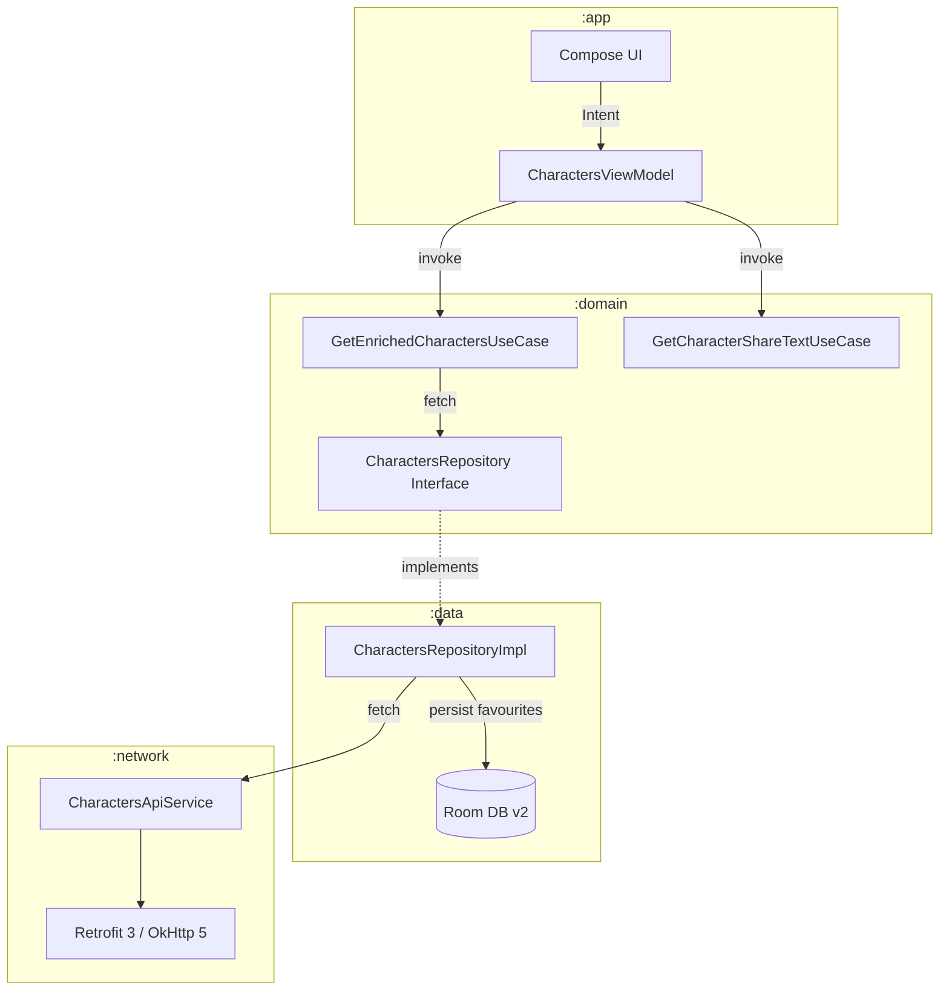

# Bonial Coding Challenge — Rick & Morty Browser

A production-quality Android application built with **Clean Architecture**, **MVI**, and **Jetpack Compose**. The app browses Rick & Morty characters with live search, infinite pagination, offline-persisted favourites, and a full CI/CD pipeline.

---

## Features

| Feature | Detail |
|---|---|
| **Character list** | Infinite-scroll grid loaded from the Rick & Morty API |
| **Live search** | 1-second debounce, API-side filtering via `?name=` query param |
| **Pagination** | Append-on-scroll; triggers when 4 items from the end of the list |
| **Favourites** | Persisted in Room DB; synced in real time across list and detail screens |
| **Character detail** | Full info screen with species, status, origin, episode count |
| **Share** | Android share-sheet with formatted character card text |
| **Offline support** | Favourites survive network loss via Room; list served from in-memory StateFlow cache |
| **Error & retry** | Human-readable error messages; one-tap retry fires immediately without debounce |
| **Shimmer loading** | Skeleton shimmer on initial load and pagination |

---

## Architecture

### Multi-Module Clean Architecture

```
:app  ──▶  :domain  ──▶  :data  ──▶  :network
 │             │
 └──▶  :core ◀─┘
```

| Module | Responsibility |
|---|---|
| **`:app`** | Compose UI, ViewModels, MVI State/Intent/Effect, Navigation, Theme |
| **`:domain`** | Use cases, repository interfaces, domain models — zero Android dependencies |
| **`:data`** | Repository implementations, Room DB, DAOs, mappers, NetworkHelper |
| **`:network`** | Retrofit 3 + OkHttp 5 client, token caching, logging interceptor |
| **`:core`** | `MviViewModel` base class, SharedPreferences, shimmer Modifier extension |

### MVI Pattern

Every screen follows strict unidirectional data flow:

```
UI (Compose)  ──Intent──▶  ViewModel  ──UseCase──▶  Repository  ──▶  [API / Room]
     ▲                          │
     └────State / Effect────────┘
```

**`MviViewModel<S, I, E>`** (`:core`)
- **State** — `MutableStateFlow<S>` updated via `setState { reduce() }`
- **Intent** — buffered `Channel<I>` (capacity 64); dispatched by `handleIntent()`
- **Effect** — conflated `Channel<E>` for one-time events (navigation, share sheet, toast)

### Data Flow Diagram



---

## Key Technical Decisions

### Search + Pagination concurrency
`searchParams: MutableStateFlow<Pair<String, Int>>` carries the query string and a **generation counter**. `flatMapLatest` cancels the previous inner flow on every new emission, making concurrent searches structurally impossible. Pagination jobs are tracked in `paginationJob: Job?` and cancelled the moment a new search fires.

### Retry without re-debounce
The generation counter doubles as a retry trigger — incrementing it forces a new StateFlow emission even when the query string is unchanged, bypassing the 1-second debounce window.

### Rate-limit handling
`withRetry()` in `NetworkHelper.kt` retries up to 20 times on HTTP 429, with a configurable delay. All other errors fail immediately. The retry predicate is injectable, making it fully testable without real delays.

### Favourites enrichment
`GetEnrichedCharactersUseCase` combines the API response `Flow` with `FavouritesRepository.getFavouriteCoverUrls(): Flow<Set<String>>` using `combine`, so the favourite state on every character card updates reactively without re-fetching from the network.

### Assisted injection for detail screen
`CharacterDetailViewModel` uses Hilt's `@AssistedInject` factory pattern so the character ID can be passed at runtime while all other dependencies are provided by the DI graph.

---

## Tech Stack

| Layer | Library | Version |
|---|---|---|
| Language | Kotlin | 2.3.20 |
| UI | Jetpack Compose + Material 3 | BOM 2025.x |
| DI | Hilt | 2.59.2 |
| Image loading | Coil | 3.4.0 |
| Database | Room | 2.8.4 |
| Networking | Retrofit 3 + OkHttp 5 | 3.0.0 / 5.3.2 |
| Navigation | Jetpack Navigation 3 | 1.1.0 |
| Async | Coroutines + Flow | 1.10.2 |
| Build | AGP + KSP + Version Catalog | 9.1.1 / 2.3.6 |
| Serialization | Gson + Kotlinx Serialization | 2.13.2 |

---

## Getting Started

### Prerequisites
- **Android Studio** Meerkat (2024.3.1) or newer
- **JDK 17+**
- **Android SDK** API 25–37

### Clone & Run
```bash
git clone https://github.com/AbdulSamadQureshi/Brochure-App.git
cd Brochure-App
git checkout develop           # always work from develop
./gradlew assembleDebug        # build debug APK
./gradlew testDebugUnitTest    # run all unit tests
./gradlew jacocoFullReport     # coverage report → build/reports/jacoco/
./gradlew ktlintCheck          # code style check
./gradlew detekt               # static analysis
```

### Contributing
```
1.  git checkout -b feature/your-feature   # branch from develop
2.  Make changes and commit
3.  Open PR targeting develop
4.  CI must pass (Code Quality + Unit Tests)
5.  Merge once green — no approval required (solo project)
```
Releases are cut by opening a `develop → main` PR. Merging it automatically builds the signed APK and publishes a GitHub Release.

---

## Testing

### Strategy

| Layer | Tool | What's tested |
|---|---|---|
| ViewModels | JUnit 4 + Mockito + Turbine | State transitions, debounce timing, pagination guards, effect emissions |
| Use cases | JUnit 4 + Mockito + Truth | Enrichment logic, blank-name sanitisation, error passthrough, Flow reactivity |
| Repository | JUnit 4 + Mockito | DTO mapping, DAO interactions, Flow emissions |
| Network | JUnit 4 + Turbine | `safeApiCall` Loading→Success/Error, `withRetry` retry counts and delays |
| UI / Screenshots | Roborazzi + Robolectric | Pixel-perfect Compose rendering against committed baselines |

### Coverage (JaCoCo)

**Lines: 80.1% | Instructions: 69.7% | Methods: 70.7%**

Excludes: generated code (Hilt, Room, Compose), UI screens, theme, navigation, `MainActivity`.

```bash
./gradlew jacocoFullReport
# → build/reports/jacoco/jacocoFullReport/html/index.html
```

### Screenshot tests
Baselines are committed to `app/src/test/screenshots/`. CI fails on any pixel diff and uploads diff PNGs as artifacts for review.

```bash
./gradlew :app:recordRoborazziDebug   # update baselines
./gradlew :app:verifyRoborazziDebug   # verify against baselines (CI)
```

---

## CI/CD Pipeline

### Branch Strategy

```
feature/*  ──PR──▶  develop  ──PR──▶  main
```

| Branch | Rules |
|---|---|
| `main` | Protected · No direct push · No force push · Cannot be deleted |
| `develop` | Protected · No direct push · No force push · Cannot be deleted |

Feature branches are **automatically deleted** after their PR is merged. `develop` and `main` are never deleted.

### Job Trigger Matrix

| Event | Code Quality | Unit Tests | Coverage | Screenshot Tests | Build & Release |
|---|---|---|---|---|---|
| Push to `develop` | ✅ | ✅ | ✅ | ✅ | ❌ |
| PR opened → `develop` | ✅ | ✅ | ✅ | ✅ | ❌ |
| PR merged → `develop` | ❌ | ❌ | ❌ | ❌ | ❌ |
| PR opened `develop` → `main` | ✅ | ✅ | ✅ | ✅ | ❌ |
| PR **merged** `develop` → `main` | ❌ | ❌ | ❌ | ❌ | ✅ |
| Direct push to `main` | ❌ | ❌ | ❌ | ❌ | ❌ |

### CI Jobs

| Job | Description |
|---|---|
| **Code Quality** | `ktlintCheck` (style) + `detekt` (static analysis, zero-tolerance). Reports uploaded as artifacts (7-day). |
| **Unit Tests** | `testDebugUnitTest` across all modules. Reports uploaded (7-day). |
| **Code Coverage** | `jacocoFullReport` — HTML + XML reports uploaded (14-day). |
| **Screenshot Tests** | `verifyRoborazziDebug` — pixel comparison against baselines. Diff PNGs uploaded on failure (7-day). |
| **Build & Release** | Signs and builds debug APK, renames to `brochure-debug-{date}-{sha}.apk`, publishes GitHub Release. Stakeholders download directly from the Releases page. |

---

## Build Variants

| Variant | Minified | Debuggable | Purpose |
|---|---|---|---|
| `debug` | No | Yes | Local development |
| `qa` | Yes (R8) | Yes | QA testing with obfuscation |
| `release` | Yes (R8) | No | Production build |

Each variant reads its API base URL and config from a corresponding `.properties` file (`debug.properties`, `qa.properties`, `release.properties`).

---

## Code Quality

| Tool | Config | Enforcement |
|---|---|---|
| **Detekt** | `config/detekt/detekt.yml` | `maxIssues: 0` — zero tolerance; CI fails on any violation |
| **ktlint** | Gradle plugin `14.2.0` | `ignoreFailures: false`; CI fails on style violations |

Key Detekt rules: max line length 140, cyclomatic complexity ≤ 25, long method ≤ 60 lines, no FIXME/STOPSHIP comments, coroutine best-practices enforced, `@Composable` functions exempt from complexity rules.
