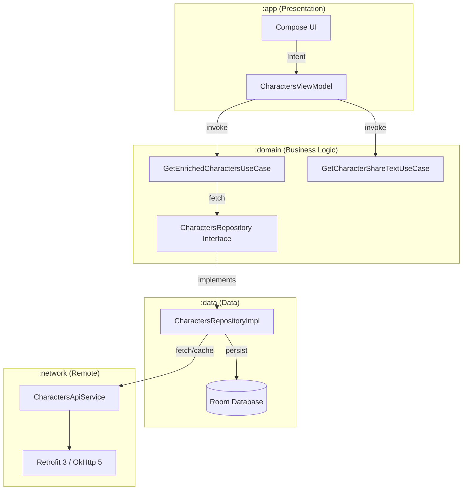

# Bonial Coding Challenge — Rick & Morty Browser 🪐

A high-performance, offline-first Android application built with **Clean Architecture**, **MVI**, and the latest **Jetpack Compose** components. This project showcases modern Android development best practices, including a multi-module setup, robust pagination, and comprehensive test coverage.

---

## 🚀 Key Highlights & "Eye-Catching" Features

- **Multi-Module Clean Architecture**: Fully decoupled modules (`:app`, `:domain`, `:data`, `:network`, `:core`) ensuring separation of concerns and lightning-fast incremental builds.
- **MVI (Model-View-Intent) with StateFlow**: A robust unidirectional data flow implementation using a custom `MviViewModel` base class for predictable state management and easier debugging.
- **Offline-First Experience**: Local persistence using **Room** ensures that the app remains functional even without an internet connection.
- **Dynamic Build Variants**: Specialized `release` and `qa` variants with custom ProGuard/R8 rules for production security and obfuscation testing.
- **Meticulous UX & Scroll State**: Smooth pagination with precise scroll-position retention using `rememberSaveable`, ensuring the user never loses their place when navigating back from details.
- **Modern Tech Stack**: Hilt for DI, Coil 3 for image loading, Retrofit 3, and Kotlin 2.3+.

---

## 🏗 Architecture & Data Flow

### The MVI Pattern
The app follows a strict flow:
`UI (Compose) → Intent → ViewModel → UseCase → Repository → [Network / Room]`

### Module Responsibilities
| Module | Responsibility |
|---|---|
| **`:app`** | Presentation: Compose UI, ViewModels, MVI State, Theme |
| **`:domain`** | Pure Business Logic: UseCases (Enrichment, Sharing), Repository Interfaces |
| **`:data`** | Data Access: Repository Impls, Room DB, Local Data Sources |
| **`:network`** | Infrastructure: Retrofit 3, OkHttp 5, API Services, JSON DTOs |
| **`:core`** | Shared: Base MVI classes, SharedPreferences, UI Extensions |

### Mermaid Data Flow


---

## 🚦 Getting Started

### Prerequisites
- **Android Studio** Meerkat (2024.3.1) or newer
- **JDK 17+**
- **Android SDK** with API level 25–37

### Clone & Run
```bash
git clone https://github.com/AbdulSamadQureshi/Brochure-App.git
cd Brochure-App
git checkout develop          # always start from develop
./gradlew assembleDebug       # build
./gradlew testDebugUnitTest   # run all unit tests
./gradlew jacocoFullReport    # generate coverage report → build/reports/jacoco/
```

### Contributing
```
1. Branch off develop:  git checkout -b feature/your-feature
2. Make changes & commit
3. Open PR targeting develop
4. CI must pass (Code Quality + Unit Tests)
5. 1 approving review required before merge
```
Releases are cut by opening a `develop → main` PR. Merging it automatically builds the APK and publishes a GitHub Release.

---

## 🛠 Tech Stack

- **UI**: Jetpack Compose (Material 3)
- **DI**: Hilt 2.59.2
- **Image Loading**: Coil 3.4.0
- **Database**: Room 2.8.4
- **Networking**: Retrofit 3.0.0 + OkHttp 5.3.2
- **Serialization**: Gson + Kotlinx Serialization (for variant-specific config)
- **Async**: Coroutines + Flow
- **Build**: Gradle Version Catalog + KSP 2.3.6

---

## 🧪 Testing & CI/CD Strategy

### ⚙️ Automated Pipeline (GitHub Actions)
I have implemented a comprehensive **CI/CD pipeline** (`.github/workflows/ci.yml`) that ensures high code standards and prevents regressions.

#### Branch Strategy
```
feature/xyz  →  develop  →  main
      PR ↗          PR ↗
```

| Branch | Protection |
|---|---|
| `main` | No direct pushes · No force pushes · Cannot be deleted · Requires PR with 1 review |
| `develop` | No direct pushes · No force pushes · Cannot be deleted · Requires PR with 1 review |

All feature branches open PRs against **`develop`**. When ready for stakeholders, a `develop → main` PR is opened and merged to produce a release.

#### CI Job Triggers

| Action | Code Quality | Unit Tests | Coverage | Screenshot Tests | Build & Release |
|---|---|---|---|---|---|
| Push to `develop` | ✅ | ✅ | ✅ | ✅ | ❌ |
| PR opened → `develop` | ✅ | ✅ | ✅ | ✅ | ❌ |
| PR merged → `develop` | ❌ | ❌ | ❌ | ❌ | ❌ |
| PR opened `develop` → `main` | ✅ | ✅ | ✅ | ✅ | ❌ |
| PR **merged** `develop` → `main` | ❌ | ❌ | ❌ | ❌ | ✅ |
| Direct push to `main` | ❌ | ❌ | ❌ | ❌ | ❌ |

#### CI Job Descriptions

| Stage | Description |
|---|---|
| **Code Quality** | Runs `ktlintCheck` (style) and `detekt` (static analysis) to ensure clean code. Reports are uploaded as artifacts. |
| **Unit Tests** | Executes all JVM unit tests (`testDebugUnitTest`) to verify business logic across all modules. |
| **Code Coverage** | Generates **JaCoCo** HTML and XML reports to monitor testing depth. |
| **Screenshot Tests** | Uses **Roborazzi** + **Robolectric** to compare UI against baselines. Fails on any pixel diff and uploads diff PNGs for review. |
| **Build & Release** | Builds the signed Debug APK, creates a **GitHub Release** with the APK attached so stakeholders can download it directly without GitHub Actions access. |

### 📊 Coverage Summary (JaCoCo)
**Lines**: **80.1%** | **Instructions**: **69.7%** | **Methods**: **70.7%**

To generate a report locally:
```bash
./gradlew jacocoFullReport
```

---

## 📦 Build Variants & ProGuard

| Variant | Minified | Purpose |
|---|---|---|
| `release` | **Yes** | Production build with full R8 optimization. |
| `qa` | **Yes** | Debuggable build with obfuscation for testing. |
| `debug` | No | Standard development build. |

---

## 📝 License
See [SOLUTION.md](SOLUTION.md) for more details on the challenge requirements and trade-offs.
